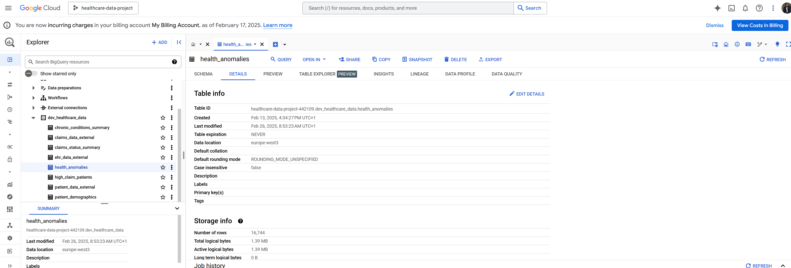

# Comprehensive Overview: Airflow Orchestration with BigQuery and dbt

This project demonstrates an end-to-end data pipeline that I implemented using Apache Airflow, Google BigQuery, and dbt to automate healthcare data workflows. It showcases how raw data is generated, ingested, tested, and transformed into curated analytical datasets. The project was developed and explained by Sujeeth.

---

## Data Pipeline Overview
- **Overview**: The diagram below depicts the pipeline’s orchestration flow. It highlights the sequence of tasks: generating raw healthcare data with Python, uploading it to Google Cloud Storage (GCS), creating BigQuery external tables over this data, executing data quality tests, and running dbt models to produce analytics-ready tables.
- **Diagram**: 

---

## Table of Contents
- [Prerequisites](#prerequisites)
- [Development Environment Setup](#development-environment-setup)
- [Google Cloud Credentials Integration](#google-cloud-credentials-integration)
- [Project Structure](#project-structure)
- [Dockerfile Customization](#dockerfile-customization)
- [Airflow DAG Design](#airflow-dag-design)
- [External Table Creation in BigQuery](#external-table-creation-in-bigquery)
- [dbt Configuration and Testing](#dbt-configuration-and-testing)
- [dbt Transformations](#dbt-transformations)
- [Environment Switching (Dev/Prod)](#environment-switching-devprod)
- [Testing and Deployment](#testing-and-deployment)
- [Result](#result)
- [Additional Notes](#additional-notes)
- [Resources](#resources)

---

## Prerequisites
- **Overview**: The pipeline was developed on a foundation of specific tools and platforms.
- **Details**:
  - A **Google Cloud Platform (GCP) project** (`healthcare-data-project-442109`) was created with billing enabled and access to GCS and BigQuery.
  - **Python 3.8+** was used as the base language for scripting and orchestration.
  - **Astro CLI** served as the local runtime environment for managing Airflow.
  - **dbt Core** was incorporated for modeling and transforming data in BigQuery.
  - The implementation relied on prior working knowledge of **Airflow, dbt, and BigQuery** to design and orchestrate the end-to-end data flow.

---

## Development Environment Setup
- **Overview**: The local development setup was created using Astro CLI to host Airflow.
- **Highlights**:
  - The Astro project was initialized (`astro dev init`), generating the base directory structure (`dags`, `include`, etc.).
  - The local Airflow development server was started (`astro dev start`) and made accessible via `http://localhost:8080`.

---

## Google Cloud Credentials Integration
- **Overview**: Secure access to GCP resources was configured to allow Airflow to communicate with BigQuery and GCS.
- **Highlights**:
  - A GCP Service Account with roles (`BigQuery Admin`, `Storage Admin`) was created, and its `service_account.json` key stored inside `/usr/local/airflow/include/gcp/`.
  - Airflow connections were configured via the UI using this key, enabling seamless execution of BigQuery and GCS tasks from within DAGs.

---

## Project Structure
- **Overview**: The project was organized to separate concerns between orchestration, scripts, and credentials.
- **Highlights**:
  - Within the `include` folder:
    - `raw_data_generation` contains Python scripts for generating and uploading mock healthcare data to GCS.
    - `gcp` stores the service account credentials.
  - The `dbt` project was placed at the **root level**, aligning with the Airflow DAGs and `include` directory.

---

## Dockerfile Customization
- **Overview**: The Astro Runtime Dockerfile was customized to install all required dependencies in an isolated virtual environment.
- **Highlights**:
  - A virtual environment was created at `/usr/local/airflow/dbt_venv`.
  - Core libraries like `dbt-bigquery`, `pandas`, `Faker`, `pyarrow`, and `numpy` were installed.
  - The environment was activated by default on container startup, ensuring dbt commands can run inside Airflow tasks.

---

## Airflow DAG Design
- **Overview**: Workflow orchestration is implemented through an Airflow DAG named `healthcare_pipeline_dag.py`.
- **Key Points**:
  - The DAG is defined with no schedule (manual triggering), tags for easy categorization, and an initial `start_date`.
  - It begins with a **BashOperator** task (`generate_data`) that executes the Python script to produce raw data files and upload them to GCS.
  - Subsequent tasks build upon this output to create BigQuery external tables and execute dbt tasks.

---

## External Table Creation in BigQuery
- **Overview**: Raw data stored in GCS is exposed to BigQuery through external tables for direct querying.
- **Key Points**:
  - SQL scripts in `create_external_tables.sql` define three external tables (`patient_data_external`, `ehr_data_external`, `claims_data_external`).
  - A **BigQueryInsertJobOperator** runs these scripts from within the DAG, enabling SQL-based querying without physically loading data into BigQuery storage.

---

## dbt Configuration and Testing
- **Overview**: dbt was used for data quality testing and modeling.
- **Key Points**:
  - A dedicated dbt project (`dbt/healthcare_dbt_bigquery_data_pipeline`) was created at the repository root.
  - `dbt_project.yml`, `profiles.yml`, and a `cosmos_config.py` were set up to enable dbt execution through Astronomer Cosmos.
  - Initial source tests were implemented to validate the raw data immediately after external table creation.

---

## dbt Transformations
- **Overview**: Transformation logic was built with dbt models to clean and reshape the data.
- **Key Points**:
  - A `DbtTaskGroup` inside the DAG runs all models within `models/`, following successful completion of tests.
  - Supporting dependencies such as `astronomer-cosmos` and `apache-airflow-providers-google` were included in `requirements.txt`.

---

## Environment Switching (Dev/Prod)
- **Overview**: The pipeline can seamlessly switch between development and production environments.
- **Key Points**:
  - The `cosmos_config.py` file uses a `target_name` variable that determines the active environment (`dev` or `prod`).
  - SQL scripts dynamically update dataset names and GCS paths according to the active target.

---

## Testing and Deployment
- **Overview**: The pipeline was validated locally before being pushed to production.
- **Key Points**:
  - dbt tests and runs were executed within the Astro CLI development container.
  - The DAG was triggered manually from the Airflow UI to verify each task’s success.
  - After switching the configuration to `prod`, the entire setup was deployed using `astro deploy`.

---

## Result
- **Overview**: The pipeline successfully automates the end-to-end data processing lifecycle.
- **Outcome**:
  - Generates raw healthcare datasets and stores them in GCS.
  - Creates BigQuery external tables on top of the raw data.
  - Transforms data through dbt into curated analytical tables (e.g., `health_anomalies`, `patient_demographics`).
  - Provides a reusable and extensible orchestration framework for healthcare data workflows.
- **Visuals**:
  - DAG: 
  - BigQuery: 
  - GCS: 

---

## Additional Notes
- Error handling was integrated using `on_failure_callback` to capture and log task failures.
- Monitoring can be extended through Slack alerts or the Airflow UI.
- Sensitive keys are stored securely through Airflow environment variables and not hard-coded in DAGs.

---

## Resources
- [Airflow Tutorials](https://airflow.apache.org/docs/apache-airflow/stable/tutorial.html)
- [dbt BigQuery Setup](https://docs.getdbt.com/reference/warehouse-setups/bigquery-setup)
- [BigQuery External Tables](https://cloud.google.com/bigquery/docs/external-data-sources)
- [Astronomer Cosmos Docs](https://github.com/astronomer/astronomer-cosmos)

---

# Astro Project Structure (Post `astro dev init`)

In addition to the custom pipeline, the repository includes the default project structure generated by the Astronomer CLI when initializing an Astro project.

## Project Contents
- **dags**: Contains Airflow DAG Python scripts (includes an `example_astronauts` DAG for demonstration).
- **Dockerfile**: Defines the Astro Runtime image and optional runtime overrides.
- **include**: Holds supporting scripts and credentials.
- **packages.txt / requirements.txt**: Used to declare OS-level and Python dependencies.
- **plugins**: Reserved for adding custom or community plugins.
- **airflow_settings.yaml**: Stores local-only Airflow variables, connections, and pools.

## Local Development
- The project can be run locally by starting the Airflow environment (`astro dev start`), verifying containers (`docker ps`), and accessing the UI at `http://localhost:8080`.

## Deployment
- The finalized pipeline was deployed to Astronomer using the standard [deployment process](https://www.astronomer.io/docs/astro/deploy-code/).

## Contact
The Astronomer CLI is maintained by the Astronomer team. For support or feature requests, their support team can be contacted directly.

